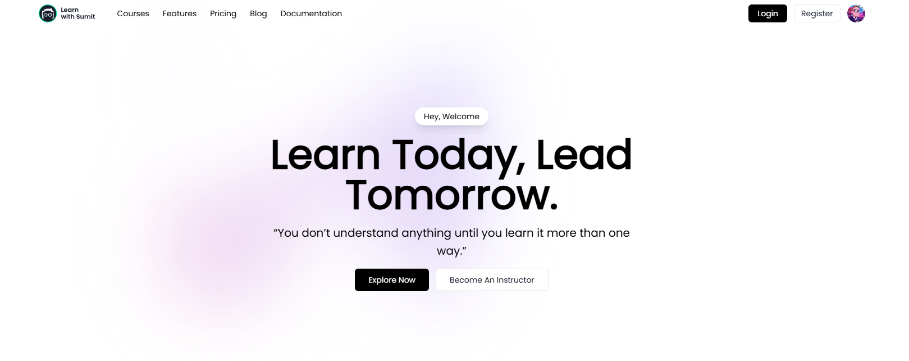

## EduConnect

**EduConnect** is a modern e-learning portal built with **Next.js (App Router)**, **Tailwind CSS**, and **MongoDB**. It supports course catalogs, lessons, quizzes, progress tracking, and secure payments with a responsive, accessible UI.

## Features

- **User Authentication:** Login/signup with email or OAuth (Google & GitHub).
- **Role-Based Access:** Secure endpoints for different user roles.
- **Course Management:** Create, update, and delete courses with modules, lessons, and resources.
- **Secure Payments:** Stripe integration for course purchases.
- **Search & Filters:** Find courses by category, tags, or keywords.
- **Responsive UI:** Fully mobile-friendly using Tailwind CSS.
- **Server-Side API Routes:** Modular Next.js App Router with protected routes and server actions.

<!-- Video & File Uploads: Upload course materials via Cloudinary. -->
<!-- Quizzes & Progress Tracking: Track student performance and course completion. -->
<!-- Reviews & Ratings: Students can review and rate courses. -->

## Screenshots



## Tech Stack

- **Next.js** (App Router)
- **Tailwind CSS**
- **MongoDB & Mongoose**
- **NextAuth / Auth.js** (Google & GitHub providers)
- **JWT Authentication**
- **Nodemailer** (emails)
- **Stripe** (payment integration)
- **Cloudinary** (file uploads)

## Installation

Follow these steps to set up the project locally:

## 1. Clone the repository

```
git clone https://github.com/khandoker-tahmid-sami/educonnect.git
cd educonnect
```

## 2. Install project dependencies

```
npm install
```

## 3. Configure environment variables

```
MONGO_URI = your_mongodb_uri

GOOGLE_CLIENT_ID = your_google_client_id

GOOGLE_CLIENT_SECRET = your_google_client_secret

GITHUB_CLIENT_ID = your_github_client_id

GITHUB_CLIENT_SECRET = your_github_client_secret

AUTH_SECRET = your_auth_secret

AUTH_TRUST_HOST=true

STRIPE_PUBLISHABLE_KEY = your_stripe_publishable_key

STRIPE_SECRET_KEY = your_stripe_secret_key

NODEMAILER_EMAIL = your_email

NODEMAILER_APP_PASS = your_app_pass
```

## 4. Start the development server

```
npm run dev
```

## 5. Open yout browser and go to

```
http://localhost:3000
```
